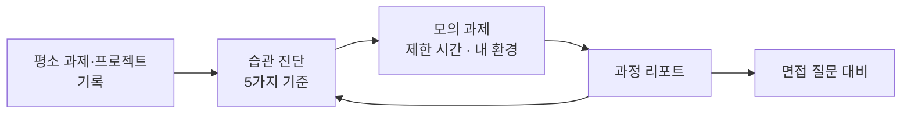

# Trace 새 기획 방향 (초안)

2026-09-23 · B (초안, A와 논의용)

## 한 줄 요약

**Trace는 "AI와 일하는 과정"을 기록해서, 학생이 그 과정을 돌아보고 연습하고 보여줄 수 있게 하는 도구로 방향을 바꾼다.** 기업이 AI 활용 과정을 채점하기 시작했는데, 학생 쪽에는 그걸 준비할 곳이 없기 때문이다.

## 왜 바꾸나

교수님 피드백은 두 가지였다.

- **Proof**: 한 사람의 무결성 증명을 넘어, 협업에서 누가 어디를 고쳤는지 추적할 수 있게 발전시켜 봐라.
- **Learn**: 기능보다 먼저 "교육적으로 우수한 학생이란 무엇인가"를 고민해라. 요즘 흐름은 "답을 잘하는 학생"에서 "질문을 잘하는 학생"으로 바뀌었다.

피드백을 따라 기능을 붙여 보다가 더 큰 문제를 발견했다.

1. **이미 있는 서비스와 겹친다.** 누가 무엇을 고쳤는지는 git, 구글 문서, 노션, Word 변경 추적이 이미 보여준다. 직접 쳤는지 붙여넣었는지는 Grammarly Authorship, Turnitin Clarity가 한다. 되묻는 AI 학습 모드는 Claude, ChatGPT, Gemini에 이미 있다.
2. **타겟이 흐리다.** 기존 기획은 설치하는 사람(학생)과 이득 보는 사람(교수, 팀원)이 달랐다. 남 좋으라고 PC를 들여다보는 프로그램을 까는 사람은 없다.
3. **기술에서 출발했다.** "PC 기록을 할 수 있다" → "어디에 쓸까" 순서였다. 문제에서 출발하지 않았다.

그래서 기술이 아니라 **문제**에서 다시 시작했다.

## 문제

**기업은 "AI로 어떻게 문제를 풀었나"를 채점하기 시작했는데, 학생은 그걸 연습하고 피드백받을 곳이 없다.** 코딩테스트가 퍼졌을 때 백준·프로그래머스 연습이 생긴 것과 같은 자리가 비어 있다.

### 국내에서 실제로 바뀐 채용

| 시기 | 기업 | 바뀐 점 |
| --- | --- | --- |
| 2026.8 | [넥슨](https://m.news.nate.com/view/20260825n23500) | 신입·인턴 코딩테스트 폐지, AI 활용 역량평가로 교체 |
| 2026.7\~8 | [크래프톤](https://www.mt.co.kr/tech/2026/08/28/2026082810491742468) | 자체 평가 솔루션 코파 프로브. 대화·프롬프트·코드·검증 기록을 자동 수집하고 사후 질의응답까지 |
| 2026.7 | [CJ올리브영](https://zdnet.co.kr/view/?no=20260721113421) | 경력 개발자 라이브 코딩 → AI 과제 (코파 프로브 사용) |
| 2026 하반기 | SK하이닉스 | 자기소개서 항목을 없애고 AI 활용 역량 서식 도입 |
| 2026.2 | [무신사](https://aimatters.co.kr/news-report/41404/) | 2차는 3시간 과제. **내 컴퓨터에서 내 AI 도구로**. AI 활용 비중이 코드 품질보다 큼 |
| 2025.1 | [컴리](https://v.daum.net/v/20250610060102680) | 개발자 코딩테스트에서 AI 사용 허용. 비개발 직군도 예정 |

네이버·카카오 등 대부분은 아직 AI를 금지한다. 바뀌는 중인 시장이다.

### 기업이 보는 것

코파 프로브와 무신사 후기에서 공통으로 보이는 기준은 다섯 가지다.

1. **문제 정의** — 무신사는 요구사항을 일부러 불완전하게 줬다
2. **AI에게 역할을 나누고 지시하기** (= 질문하기)
3. **근거 찾기와 결정**
4. **오류 잡기와 결과 검증**
5. **결정을 설명하기**

교수님이 말한 "질문을 잘하는 학생"이 그대로 채용 기준이 됐다.

### 응시자는 혼자 준비한다

[무신사 후기 1](https://velog.io/@durumi99/%EB%AC%B4%EC%8B%A0%EC%82%AC-AI-Native-Engineer-2%EC%B0%A8-%EC%BD%94%EB%94%A9%ED%85%8C%EC%8A%A4%ED%8A%B8-%ED%9A%8C%EA%B3%A0) · [후기 2](https://velog.io/@bcgo99/2026-%EB%AC%B4%EC%8B%A0%EC%82%AC-MUSINSA-ROOKIE-AI-NATIVE-ENGINEER%EC%9D%B8%ED%84%B4-1%EC%B0%A8-2%EC%B0%A8-%EC%BD%94%EB%94%A9-%ED%85%8C%EC%8A%A4%ED%8A%B8-%ED%9B%84%EA%B8%B0)에서 보이는 것:

- 평가 기준을 공식으로 안내받지 못했다. 잡코리아도 "안내가 명확하지 않은 경우가 많다"고 한다
- 프롬프트 템플릿, 여러 AI로 교차 검증하는 전략을 스스로 만들었다
- 3시간 중 절반 이상을 요구사항 분석과 결정 근거 기록에 썼다
- 한 응시자는 프롬프트 파일 17개를 손으로 정리해서 같이 제출했다

찾을 수 있는 준비 자료는 교육 업체 블로그의 가이드뿐이었다.

## 대상

**AI 활용 역량평가를 앞둔 개발 직군 취준생**이 첫 대상이다. 설치하는 사람과 이득 보는 사람이 같다.

- 평가를 보는 기업이 늘고 있고, 형식이 과제형(내 컴퓨터 · 내 AI 도구 · 제한 시간)으로 모이고 있다
- 준비할 곳이 없어서 각자 방법을 만들어 쓰고 있다
- 결과가 합격과 직결돼서 아픔이 분명하다

다음 대상은 **AI를 쓰는 과제가 많은 대학생 전반**이다. 교수님이 말한 "질문을 잘하는 학생"으로 가는 연습을 평소 과제에서 하게 한다. 비개발 직군(기획, 마케팅)으로 평가가 넓어지면 그쪽도 대상이 된다.

**대상이 아닌 것**: 학생을 확인하려는 교수, 팀원을 감시하려는 팀장. 남을 확인하는 용도로는 만들지 않는다.

## 기존 서비스와 비어 있는 칸

**채점하는 쪽은 이미 있고, 준비하는 쪽이 비어 있다.** 특히 "내 환경에서, 평소 작업까지" 보는 곳은 없다.

| 종류 | 예 | 하는 일 | 한계 |
| --- | --- | --- | --- |
| 채용 시험 | [프로그래머스 AI 역량평가](https://programmers.co.kr/ai-assessment), 코파 프로브, [HackerRank](https://support.hackerrank.com/articles/5821380141-ai-assisted-interviews) | 프롬프트·수정 이력·검증 기록을 모아 채점 | 기업용. 시험 보는 1\~3시간만. 개인은 체험 정도 |
| 면접 연습 | [HackerRank AI Fluency 모의 면접](https://www.hackerrank.com/mock-interviews/all-roles/ai-fluency), [NeetCode AI Coding](https://neetcode.io/practice/ai-coding) | AI와 함께 문제를 풀고 피드백 | 해외, 자기 웹 환경 안에서만. AI를 어떻게 썼는지는 거의 안 봄 |
| 교실 | [Turnitin Clarity](https://dts.ucla.edu/news/turnitin-clarity-enhancement-writing-process-tools-exploration-0), [Grammarly Authorship](https://support.grammarly.com/hc/en-us/articles/29548735595405-About-Grammarly-Authorship) | 글쓰기 과정 다시 보기, 붙여넣기·AI 구분 | 문서 도구 하나 안에서만. 목적이 "몰래 썼나" 확인 |
| 코드 추적 | [git-ai](https://usegitai.com/) | 코드 줄마다 어떤 AI·프롬프트에서 나왔는지 | 코드 관리용. 사람의 습관은 안 봄 |
| 코딩테스트 연습 | 백준, 프로그래머스, 코드트리 | 알고리즘 문제 | AI 활용과 관계없음 |

**Trace가 들어갈 칸**: 학생의 컴퓨터에서, 여러 AI 창·IDE·문서를 넘나드는 과정을 기록하고, 기업이 보는 기준으로 돌아보게 한다. 무신사처럼 실제 시험이 내 환경에서 치러지므로, 웹 사이트 안 연습장으로는 다 못 담는다.

## Trace가 하는 일

**평소 습관을 진단하고, 약한 부분을 실전 형식으로 연습하게 한다.** 한 마디로 학생 쪽의 코파 프로브다.

평소 기록으로 약점을 찾고, 모의 과제로 연습하고, 그 결과가 다시 진단에 쌓인다.

| 기능 | 하는 일 | 예 |
| --- | --- | --- |
| **습관 진단** | 평소 작업에서 AI를 어떻게 쓰는지를 기업 기준 5가지로 돌아봄 | "오류가 나면 시도 없이 바로 묻는다", "답을 받고 실행·테스트 없이 붙인다", "AI 하나만 쓴다" |
| **모의 과제** | 요구사항이 일부러 비어 있는 과제를 제한 시간 안에 내 컴퓨터에서 내 AI 도구로 풀어 봄 | 무신사형 "수강신청 백엔드 3시간" |
| **과정 리포트** | 문제 정의 → 지시 → 결정 → 검증 → 설명 순서로 내 과정을 보여주고, 잘한 곳과 빠진 곳을 짚음 | "요구사항 빈 곳 3개 중 1개만 명시적으로 결정함" |
| **면접 대비** | 내 기록을 보고 "여기서 왜 이렇게 결정했나요?" 질문을 만듦 | 코파 프로브의 사후 질의응답 대비 |
| **과정 정리** | 프롬프트와 결정 근거를 제출용으로 자동 정리 | 응시자가 손으로 만든 "프롬프트 파일 17개" |

**원칙은 그대로**: 점수를 남에게 보내지 않는다. 기록은 학생 PC에 먼저 남고, 밖으로 나가는 건 본인이 고른 것뿐이다.

## 지금 만든 것은 어떻게 되나

**바닥(수집기 → 서버 → 화면)은 그대로 쓰고, 위에 올리는 분석과 화면이 바뀐다.** 앞으로 2주간 할 일(관통1)은 방향과 상관없이 필요하다.

| 지금 있는 것 | 새 방향에서 |
| --- | --- |
| 수집기 (창 전환, 입력 횟수, 복사·붙여넣기 출처, Word·PPT 변화, git) | **그대로.** 여러 AI 창과 IDE를 넘나드는 과정을 보는 게 핵심 |
| 확장 프로그램의 AI 질문·답변 발춌 수집 (Learn) | **핵심이 됨.** "질문"이 진단의 주인공 |
| 맥락 수집 (오류, 실행 결과, 직접 수정) | **그대로.** "묻기 전 시도", "답 받은 뒤 검증"을 보는 근거 |
| 서버·DB (A) | **그대로** |
| React 화면 (한눈에, 타임라인, 리포트, 흑연 디자인) | **골격은 살림.** 리포트 내용이 5가지 기준 진단으로 바뀜 |
| Learning Report의 AI 분석 | **바뀜.** 학습 요약 → 기업 기준으로 진단 |
| 해시 체인 · 봉인 · 증명서 (Proof) | **뒤로 미룸.** "내 과정 기록이 진짜"라는 증명이 필요해질 때(포트폴리오 제출) 다시 씀 |
| 협업 추적 (교수님 피드백 1) | **이번 학기에는 안 함.** git·구글 문서가 이미 하고 있음. 교수님께 이유를 설명해야 함 |
| 새로 만들 것 | 모의 과제 문제와 제한 시간 모드, 5가지 기준 진단 프롬프트, 면접 질문 생성 |

보안은 방향과 상관없이 고쳐야 한다: 복사한 글의 지문에 비밀값 섞기, AI로 보내기 전 API 키·개인정보 가리기.

## 아직 모르는 것

**가장 큰 빈칸은 "학생들이 실제로 막막해하는가"다.** 찾은 응시 후기는 두 개뿐이고, 둘 다 잘 본 사람이 썼다.

| 모르는 것 | 확인할 방법 |
| --- | --- |
| 준비할 곳이 없어서 답답해하는 학생이 많은가 | 에브리타임·블라인드·링커리어에서 "AI 역량평가", "AI 과제 전형" 검색. 지원했거나 할 사람 5명에게 10분씩 물어보기 |
| 평소 습관 진단이 실제 시험 점수에 도움이 되는가 | 우리 둘이 모의 과제를 직접 풀고 리포트가 쓸모 있는지 확인 |
| 교수님이 협업 추적을 빼도 괜찮다고 하실지 | 이 문서를 들고 여쭤보기 |
| 비개발 직군으로 얼마나 빨리 퍼질지 | 컴리·SK하이닉스 사례 지켜보기 |

**위험 요소**

- **시험 만드는 쪽이 연습판을 낼 수 있다.** 프로그래머스는 코딩테스트 때도 기업용 시험과 개인 연습을 같이 해서 이겼다. 우리 강점은 "내 환경에서, 평소 작업까지"다.
- **시험 형식이 계속 바뀐다.** 회사마다 다르고 채점 기준도 공개되지 않는다. 진단은 공통 기준 5가지에 맞춘다.
- **PC를 기록하는 프로그램이라 설치가 부담이다.** 모의 과제를 풀 때만 켜는 모드부터 시작하면 부담이 작다.
- **지금은 개발 직군뿐이다.** 대상이 좁다.

## 같이 정할 것

**관통1(10/7)은 그대로 가고, 그 전에 이 방향에 동의하는지만 정하자.** 수집기 → 서버 → DB는 어느 방향이든 필요하다.

- [ ] 이 방향(취업용 AI 활용 역량 진단·연습)에 동의하는지, 다른 생각이 있는지
- [ ] 협업 추적을 빼는 것을 교수님께 어떻게 설명할지
- [ ] 사람들에게 물어보기 — 각자 2\~3명씩, 이번 주 안에
- [ ] 기획서(`0-최종 기획서.md`)를 누가 고칠지
- [ ] 역할: 모의 과제·진단 프롬프트(서버·AI 쪽)와 수집기·화면 쪽을 어떻게 나눌지

## 출처

- [넥슨, 코딩테스트 없앗다 - 네이트 뉴스](https://m.news.nate.com/view/20260825n23500)
- [크래프톤 Cofa-Probe 현장 검증 - 머니투데이](https://www.mt.co.kr/tech/2026/08/28/2026082810491742468)
- [크래프톤, AI와 일하는 과정 평가한다 - 네이트 뉴스](https://news.nate.com/view/20260830n01997)
- [CJ올리브영, 코딩테스트 대신 AI 과제 - ZDNet Korea](https://zdnet.co.kr/view/?no=20260721113421)
- [무신사는 개발자 면접에서 코덱스를 테스트한다 - AI매터스](https://aimatters.co.kr/news-report/41404/)
- [무신사 AI Native Engineer 2차 회고 - velog](https://velog.io/@durumi99/%EB%AC%B4%EC%8B%A0%EC%82%AC-AI-Native-Engineer-2%EC%B0%A8-%EC%BD%94%EB%94%A9%ED%85%8C%EC%8A%A4%ED%8A%B8-%ED%9A%8C%EA%B3%A0)
- [무신사 ROOKIE AI NATIVE ENGINEER 1·2차 후기 - velog](https://velog.io/@bcgo99/2026-%EB%AC%B4%EC%8B%A0%EC%82%AC-MUSINSA-ROOKIE-AI-NATIVE-ENGINEER%EC%9D%B8%ED%84%B4-1%EC%B0%A8-2%EC%B0%A8-%EC%BD%94%EB%94%A9-%ED%85%8C%EC%8A%A4%ED%8A%B8-%ED%9B%84%EA%B8%B0)
- [컴리, 코딩시험 챗GPT 써도 된다 - 다음](https://v.daum.net/v/20250610060102680)
- [구글부터 컴리까지, AI 활용 코딩 테스트 현황 - 잡코리아](https://www.jobkorea.co.kr/goodjob/tip/view?News_No=22546)
- [프로그래머스 AI 역량평가](https://programmers.co.kr/ai-assessment)
- [HackerRank AI-Assisted Interviews](https://support.hackerrank.com/articles/5821380141-ai-assisted-interviews)
- [HackerRank AI Fluency 모의 면접](https://www.hackerrank.com/mock-interviews/all-roles/ai-fluency)
- [NeetCode AI Coding](https://neetcode.io/practice/ai-coding)
- [Turnitin Clarity - UCLA](https://dts.ucla.edu/news/turnitin-clarity-enhancement-writing-process-tools-exploration-0)
- [Grammarly Authorship](https://support.grammarly.com/hc/en-us/articles/29548735595405-About-Grammarly-Authorship)
- [git-ai](https://usegitai.com/)
